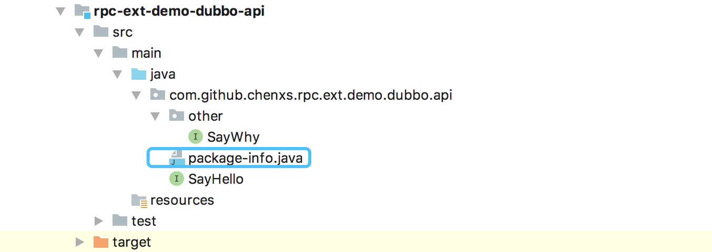
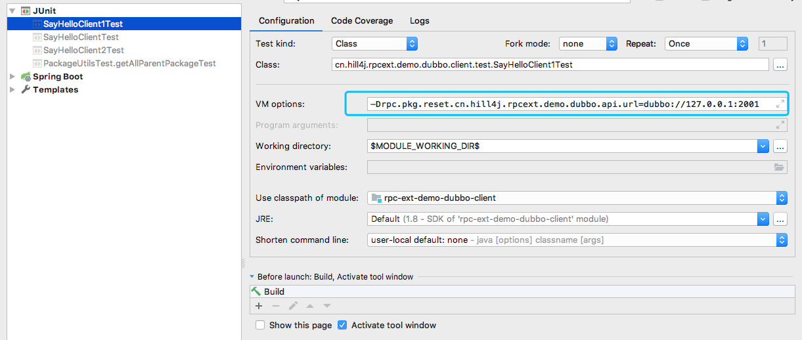

# rpc-ext
[github项目地址](https://github.com/chenxs/rpc-ext)

## 主要功能规划


|功能名|简要功能描述|功能进度|最低版本|
|-|-|-|-|
|DUBBO rpc服务应用级别点对点直连|在本地测试可以，通过配置参数，将指定应用下的所有rpc服务都指向指定的服务器|完成|1.1|
|DUBBO rpc服务服务端客户端统一配置|将dubbo的rpc服务的服务端配置信息和客户端配置信息通过自定义注解配置到api接口上|完成|1.2|
|DUBBO rpc服务服务端客户端统方法级配置|rpc方法方法级配置超时/重置等信息|规划中|-|

# rpc-ext使用文档

 * [rpc-ext](#rpc-ext)
       * [主要功能规划](#主要功能规划)
    * [rpc-ext使用文档](#rpc-ext使用文档)
    * [maven依赖:已发布到maven中央仓库](#maven依赖已发布到maven中央仓库)
       * [DUBBO rpc服务应用级别点对点直连](#dubbo-rpc服务应用级别点对点直连)
          * [解决的痛点](#解决的痛点)
          * [其他的解决方案](#其他的解决方案)
          * [本方案的解题思路](#本方案的解题思路)
          * [使用方式](#使用方式)
             * [api包中定义RpcInfo的使用方式](#api包中定义rpcinfo的使用方式)
             * [api包中未定义RpcInfo的使用方式一](#api包中未定义rpcinfo的使用方式一)
             * [api包中未定义RpcInfo的使用方式二](#api包中未定义rpcinfo的使用方式二)
       * [rpc服务服务端客户端统一配置](#rpc服务服务端客户端统一配置)
          * [解决问题](#解决问题)
          * [解题思路](#解题思路)
          * [相对dubbo的优势](#相对dubbo的优势)
          * [使用方式](#使用方式-1)
---
# maven依赖:已发布到maven中央仓库
```
        <dependency>
            <groupId>cn.hill4j.rpcext</groupId>
            <artifactId>rpc-ext-core</artifactId>
            <version>1.2</version>
        </dependency>
```

## DUBBO rpc服务应用级别点对点直连

### 解决的痛点
由于现有的rpc服务框架的服务暴露和服务发现都是基于服务级别的，所以导致在对rpc的单元测试当需要点对点直连时，直连的粒度也是到服务级,一旦要测的功能设计到的rpc服务较多时，如果通过原始的点对点直连配置，就需要大量的配置来，加大了rpc服务的单元测试难度。

### 其他的解决方案
通过个性化配置文件，每个开发者通过指定的唯一的版本号将本地服务发布到注册中心，在服务引用时通过这个特定的版本好来寻找服务。但是该方案还是存在了在每个服务上都需要加上指定版本好的占位符配置项，而且是必不可少的，这样虽然解决了问题但还是会引来太多的额外的配置信息。

### 本方案的解题思路
  
  a.通过在api的根包下加上自定义注解，用来指定api包的服务的在集群中的唯一标示：应用名
  
  b.在客户端服务的启动参数里加上点对点直连配置项
  
  c.在spring容器初始化时根据点对点直连配置项修改指定应用下的referenceBean的定义信息，即加上直连的url地址和扩大rpc服务的超时事件为五分钟

### 使用方式

#### demo地址：
https://github.com/chenxs/rpc-ext-demo/tree/master/rpc-ext-demo-dubbo

#### api包中定义RpcInfo的使用方式
1.在api根包下添加cn.hill4j.rpcext.core.rpcext.dubbo.annotation.RpcInfo注解

如:服务端提供的api包的更目录为cn.hill4j.rpcext.demo.dubbo.api,则在cn.hill4j.rpcext.demo.dubbo.api添加package-info.java并在package-info.java添加RpcInfo并指明应用名“api-test”



package-info.java的内容
```
@RpcInfo(appName = "api-test")
package cn.hill4j.rpcext.demo.dubbo.api;

import cn.hill4j.rpcext.core.rpcext.dubbo.annotation.RpcInfo;
```

2.客户端启动参数添加应用直连地址配置项

应用直连地址配置项格式:

`rpc.reset.${appName}.url=dubbo://${ip}:${port}`


#### api包中未定义RpcInfo的使用方式一

1.客户端启动参数添加应用与包之间映射关系的配置项

格式：`rpc.reset.${appName}.apiPackage=${rootPackageName}`

2.添加应用直连地址配置项

格式：`rpc.reset.${appName}.url=dubbo://${ip}:${port}`

示例：


#### api包中未定义RpcInfo的使用方式二

1.客户端启动参数直接添加java包与直连地址之间映射关系的配置项

格式：`rpc.pkg.reset.${rootPackageName}.url=dubbo://${ip}:${port}`

示例：



---

## rpc服务服务端客户端统一配置

### 解决问题
由于rpc服务中存在服务提供方和服务使用方,通常在开发过程中,服务提供方和服务使用方分别有一套配置来定义服务的配置信息，而在服务使用方通常是直接使用服务提供方的配置信息，本组件基于spring-boot的约定大于配置的思想，将服务提供方和服务使用方的通用配置统一通过注解定义在服务api包上，以达到一次配置，服务提供方和服务使用方共同使用的目的，来减少rpc服务开发过程中的多余配置

### 解题思路
1.通过定义通过的服务描述注解@RpcApi来统一描述服务提供方和服务使用方的通用配置信息
2.在服务提供方通过启动注解@EnableRpcProvider来驱动加载RpcApi配置信息来暴露服务
3.在服务使用方通过启动注解@EnableRpcReferences来驱动加载RpcApi配置信息来引用Rpc服务

### 相对dubbo的优势
1.将服务提供者和服务引用者当作普通的spring bean直接通过spring的注解来服务服务和服务引用.
2.支持一个服务提供者实现多个@RpcApi接口并一次性注册到注册中心

#### demo地址：
https://github.com/chenxs/rpc-ext-demo/tree/master/rpc-ext-demo-unity-dubbo

### 使用方式
1.在服务定义的api接口类上加上@RpcApi注解,并添加rpc服务配置信息如：
```
package cn.hill4j.rpc.ext.demo.unity.dubbo.api;
import cn.hill4j.rpcext.core.rpcext.dubbo.annotation.RpcApi;

@RpcApi(timeout = 1000,retries = 3)
public interface SayDubboRpc {
    String say();
}
```

2.服务暴露
 a.dubbo注册中心配置信息/任何dubbo注册中心配置方式都可,例如通过application.yml配置：
```
dubbo:
  application:
    name: unity-dubbo-service
  registry:
    address: zookeeper://127.0.0.1:2181
```
 b.服务启动类上加上@EnableRpcProvider注解来驱动spring加载rpc服务暴露配置信息,如：
 ```
 package cn.hill4j.rpc.ext.demo.unity.dubbo;
 
 import cn.hill4j.rpcext.core.rpcext.unity.dubbo.annotation.EnableRpcProvider;
 import org.springframework.boot.ApplicationArguments;
 import org.springframework.boot.ApplicationRunner;
 import org.springframework.boot.WebApplicationType;
 import org.springframework.boot.autoconfigure.SpringBootApplication;
 import org.springframework.boot.builder.SpringApplicationBuilder;
 
 @SpringBootApplication
 @EnableRpcProvider( "demo-unity-dubbo")
 public class ServiceStart implements ApplicationRunner {
     public static void main(String[] args) {
         new SpringApplicationBuilder(ServiceStart.class)
                 .web(WebApplicationType.NONE)
                 .run(args);
     }
 
     @Override
     public void run(ApplicationArguments args) throws Exception {
         while (true){
             Thread.sleep(100000);
         }
     }
 }
 ```
 c.通过spring原生注解将RpcApi定义的服务实现类加载到spring上下文并暴露服务
 ```
 package cn.hill4j.rpc.ext.demo.unity.dubbo.impl;
 import cn.hill4j.rpc.ext.demo.unity.dubbo.api.SayDubboRpc;
 import org.springframework.stereotype.Component;
 
 /**
  * 2019/9/18 23:10<br>
  * Description: 服务测试实现
  * 可以直接通过spring的@Component、@Service等注解来暴露服务，同时也可以通过dubbo的@Service注解来暴露服务
  */
 @Component
 public class SayDubboRpcImpl implements SayDubboRpc{
 
     @Override
     public String say() {
         return System.currentTimeMillis() + ":hello dubbo rpc";
     }
 }
 ```
3.服务引用
 a.dubbo注册中心配置信息(只是添加application.yml或application.properties文件不可行,获取优化,dubbo的bug),通过dubbo.properties配置：
 ```
 dubbo.application.name = unity-dubbo-client
 dubbo.registry.address = zookeeper://127.0.0.1:2181
 ```
 b.服务启动类上加上@EnableRpcReferences注解来驱动spring加载rpc服务引用配置信息来生成invoker代理类,如：
 ```
 package cn.hill4j.rpc.ext.demo.unity.dubbo.client;
 
 import cn.hill4j.rpcext.core.rpcext.unity.dubbo.annotation.EnableRpcReferences;
 import org.springframework.boot.WebApplicationType;
 import org.springframework.boot.autoconfigure.SpringBootApplication;
 import org.springframework.boot.builder.SpringApplicationBuilder;
 import org.springframework.context.annotation.ImportResource;
 
 @SpringBootApplication
 @EnableRpcReferences(basePackages = "cn.hill4j.rpc.ext.demo.unity.dubbo")
 public class ClientStart {
     public static void main(String[] args) {
         new SpringApplicationBuilder(ClientStart.class)
                 .web(WebApplicationType.NONE)
                 .run(args);
     }
 }
 ```
c.通过spring原生注解将RpcApi定义的服务动态生成invoker代理类并注入到使用方的属性上
```
package cn.hill4j.rpc.ext.demo.unity.dubbo.client;

import cn.hill4j.rpc.ext.demo.unity.dubbo.api.SayDubboRpc;
import org.springframework.stereotype.Component;

import javax.annotation.Resource;

@Component
public class SayDubboRpcClient {
    /**
     * 可以通@Resource和@Autowired来定义服务引用，同时也可以通过dubbo的@Reference来定义服务引用
     */
    @Resource
    private SayDubboRpc sayDubboRpc;
    
    public String say(){
        return sayDubboRpc.say();
    }
}
```
